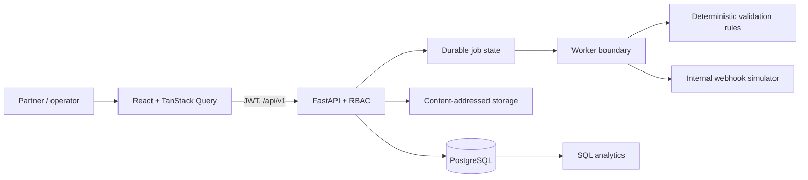
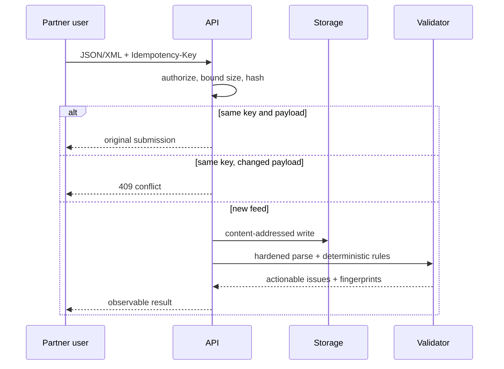

# ChannelBridge

**A media-partner onboarding and catalog-feed validation platform with JSON/XML ingestion, actionable reports, retry simulation, transparent launch readiness, and cross-partner analytics.**

> **ChannelBridge is an independent educational project. It is not affiliated with, endorsed by, or integrated with YouTube, Google, or any commercial streaming platform.** All companies, programs, contacts, feeds, and events are fictional.

ChannelBridge is a complete portfolio application for the work between signing a fictional content partner and approving a simulated launch. It turns malformed catalogs into plain-language fixes, gives partners a guided route to readiness, and gives operators a portfolio-wide view of recurring integration friction.

## What works

- JSON and safely parsed XML 1.0 feeds via multipart upload or direct REST submission
- Idempotency-key replay, changed-payload conflicts, content hashes, bounded upload sizes, and safe filenames
- Deterministic, modular validation across identifiers, metadata, language/territory, dates, artwork, hierarchy, and schema
- Filterable actionable reports plus authenticated CSV and JSON downloads
- Four JWT-backed demo roles with server-side partner tenant isolation
- Explicit readiness weights and regression-friendly status workflow
- Bounded deterministic retry backoff, one-time webhook secrets, internal-only callback simulation, and auditing
- Eight fictional partners, 100+ synthetic catalog records, failed deliveries, retries, repeated errors, and varied readiness
- SQL-backed operational dashboard and cross-partner analytics
- Searchable in-app documentation and error reference
- Structured request logs, request IDs, security headers, `/health`, and `/ready`
- Docker Compose, tests, CI, feed generator, and reproducible benchmark harness

## Architecture



The API is the authorization boundary. Partner users can access only their `partner_id`; operators can inspect all tenants; administrator-only controls remain server-enforced. PostgreSQL is used in Compose and SQLite keeps local tests lightweight. MinIO demonstrates a local object-storage service boundary; the active adapter is filesystem-based and **no AWS usage is claimed**.

## Processing flow



## Onboarding and readiness

The lifecycle is draft → organization configured → first feed → validation → action required/revalidation → operational review → launch ready → simulated launch. New blocking failures can regress a partner. The visible score is a simple sum, never an unexplained AI estimate:

| Requirement | Weight |
|---|---:|
| Organization configuration | 10% |
| Technical contacts | 10% |
| Valid feed | 25% |
| No blocking issues | 25% |
| Webhook verification | 10% |
| Launch checklist | 20% |

## Quick start

Requirements: Docker Desktop and Docker Compose.

```bash
docker compose up --build
docker compose exec api python -m app.seed
```

Open [http://localhost:5173](http://localhost:5173). API documentation is at [http://localhost:8000/docs](http://localhost:8000/docs).

For native development with Python 3.12+ and Node 22+:

```bash
make setup
make seed
# terminal 1
cd backend && .venv/bin/uvicorn app.main:app --reload
# terminal 2
cd frontend && npm run dev
```

## Fictional demo accounts

All use password `ChannelBridgeDemo!` and exist only after seeding.

| Persona | Email |
|---|---|
| Partner administrator | `admin@northstar.example` |
| Partner technical user | `technical@northstar.example` |
| Platform operator | `operator@channelbridge.local` |
| Platform administrator | `admin@channelbridge.local` |

## Repository map

- `backend/app` — API, auth, SQL models, rule engine, seed, worker boundary, webhook receiver
- `frontend/src` — responsive role-aware application and reusable UI states
- `schemas` / `samples` — independent JSON Schema, XSD, valid and invalid feeds
- `scripts` — deterministic feed generation and benchmarks
- `docs` — product, architecture, analytics, security, testing, limitations, and resume claims
- `.github/workflows` — backend, frontend, and security/Compose gates

## Commands

| Command | Purpose |
|---|---|
| `make setup` | Install native dependencies |
| `make dev` / `make down` | Start or stop the Compose stack |
| `make seed` / `make reset` | Deterministically reset demo data |
| `make test` | Backend and frontend unit tests |
| `make lint` | Python and TypeScript static gates plus frontend build |
| `make benchmark` | Run 100/1k/10k-record validation trials |

Sample feeds live in [`samples/`](samples/) and the independent schema is documented in [`docs/feed-specification.md`](docs/feed-specification.md). Security boundaries and omissions are explicit in [`docs/security.md`](docs/security.md) and [`docs/limitations.md`](docs/limitations.md).

## Testing, performance, and security

Tests exercise parsing, deterministic findings, issue quality, retry math, webhook signatures, auth, tenant isolation, and idempotency conflict behavior. CI builds both applications and validates Compose. Benchmarks run three trials without fabricated targets; record the commit and host environment when publishing results.

This local demo intentionally does not include production key management, TLS termination, distributed rate limiting, malware scanning, arbitrary external webhooks, URL fetching, compliance certification, or public deployment.

## Resume-safe description

“Built an independent FastAPI/React partner-onboarding simulator with tenant RBAC, JSON/XML catalog validation, idempotency, actionable reports, retry and webhook simulation, transparent readiness scoring, and SQL-backed analytics.”

Do not claim official compatibility, real customers, production deployment, AWS usage, compliance certification, or professional experience based on this project. See [`docs/resume-claims.md`](docs/resume-claims.md).

## Roadmap

1. Move inline demo processing to a transactionally claimed worker queue.
2. Add a production-grade MinIO adapter and streaming JSON parser.
3. Expand browser automation across the entire corrected-feed journey.
4. Add configurable validation-rule versions and signed webhook delivery transport.
5. Capture current application screenshots after hosted preview authorization.

MIT © 2026 Nithin Reddy Poola.

