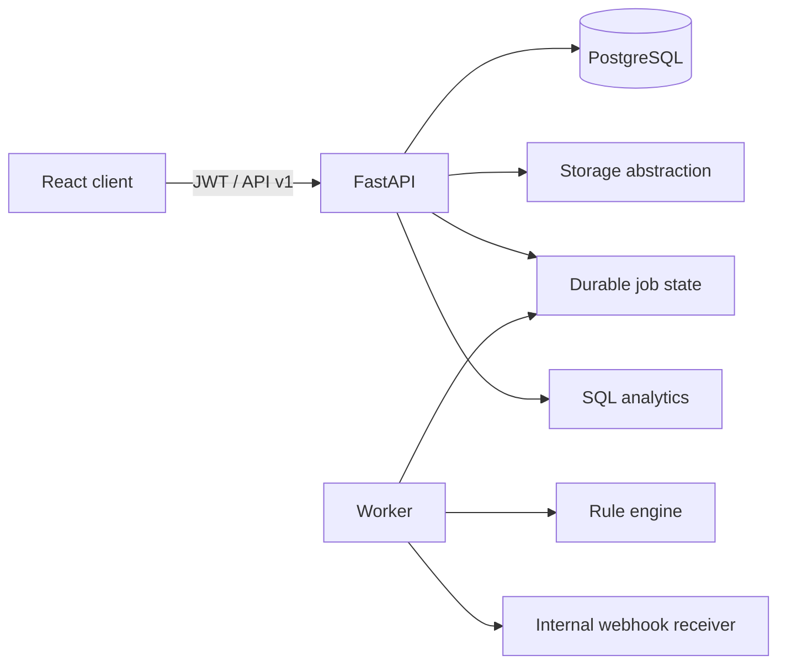

# Architecture

FastAPI enforces role and partner scope before querying tenant records. SQLAlchemy targets PostgreSQL in Compose and SQLite for lightweight tests. Files are content-addressed through a local storage adapter; the MinIO service demonstrates the local S3-compatible boundary but is not represented as AWS. Validation rules are pure deterministic functions. The current worker process exposes the durable polling boundary; local API processing is synchronous to keep the demo reproducible.

